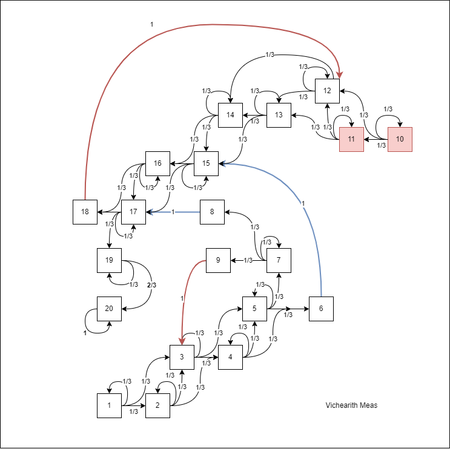

<!-- # Computational Linear Algebra: Exam 3 -->
## *Tuesday, May 3 - Monday, May 9, 2022*

### Upload an html file to Moodle and turn in any hand written work by noon on Monday, May 9, 2022


### <span style="color:red">Vichearith Meas</span> 

### <span style="color:red">I pledge my honor that I have not participated in any dishonest work on this exam, nor do I know of dishonest work done by other students on this exam.</span> 


The following line sources functions from the class file `365Functions.r`. Feel free to use any of these functions.
```{r, message=FALSE, warning=FALSE}
source("https://www.macalester.edu/~dshuman1/365/365Functions.r")
source("https://www.macalester.edu/~dshuman1/365/2022.365.E3.Data.r")
library(Matrix)
library(expm)
library(tidyr)
library(ggplot2)
# library(splines)
library(tidyverse)
library(ggrepel)
library(pracma)
```

## Problem 1

### a
::: answer

```{r}
options(width=1000, digits = 2)
p1.A = spMatrix(ncol = 20, nrow=20, 
                i = c(1:20, 1:19, 1:18) , 
                j = c(1:20, 2:20, 3:20),
                x = c(rep(1/3, 20),rep(1/3, 19),rep(1/3, 18)))
# If the player reach state 20, the player stays the in the same state
p1.A[20,20] = 1  
#  A space that is the top of a chute, she instantaneously falls to the bottom of the slide
p1.A[9,] = 0
p1.A[9,3] = 1
p1.A[18,] = 0
p1.A[18,12] = 1
#  player reaches the bottom of the ladder, the player is instantaneously transferred to the top of the ladder
p1.A[6,] = 0
p1.A[6,15] = 1
p1.A[8,] = 0
p1.A[8,17] = 1
# 2 changes to reach 20 from 19
p1.A[19,20] = 2/3


#  Check row sum 
rowSums(p1.A)

p1.A
```
:::

### b

:::answer
```{r}
# start from the first position
x0<-c(1, rep(0,19))
#  find transpose of matrix
p1.At<-as.matrix(t(p1.A))
p.after.20.turn<-p1.At%^%(20)%*%x0
#  probability to reach 20 
p.after.20.turn[20]
```
:::

### c 

::: answer

The  probability that  you, David, find  me on:

-  square 19 is 20.7%
-  square 10 is 00.0%

I most likely be on square 17th. 

```{r}
options(digits = 3)
#  update the matrix
p1.A.endless = as.matrix(p1.A)
p1.A.endless[20,] = 0
p1.A.endless[20,1] = 1

p1.At.endless = t(p1.A.endless)
e.out<-eigen(p1.At.endless)
p1.At.endless.longrun = as.numeric(e.out$vectors[,1])

# square 19
p1.At.endless.longrun[19]
# square 10
p1.At.endless.longrun[10]
# Which state mostly to end up in
match(max(p1.At.endless.longrun), p1.At.endless.longrun)

```
:::

### d


::: answer

As the number of $k$ increase, $A^{(k)}x_0$ converges to the dominant eigenvector of the augmented adjacency matrix, and is therefore a good measure of probability of state I may end up in long term. Therefore, I only need to look at the probability for the state that is asked. 
:::

## Problem 2

### a

::: answer

```{r}
A<-cbind(c(1,5,-2,3),c(2,-4,2,2),c(1,2,-1,3))

A.out  = svd(A, nu = nrow(A))
(f = A.out$v[,1])
(g = A.out$v[,2])


t(A %*% f ) %*% (A %*% g)
t(f) %*% g
```
:::

### b 

::: answer

```{r}
A.out  = svd(A, nu = nrow(A))

h = 2*A.out$u[,4]

vnorm(as.matrix(h), p = 2)

t(A) %*% h
```
:::

### c 

::: answer

$AA^T$ is real and symmetric so it is diagonalizable. $AA^T$ has the of 3 and therefore not a  full rank and $A$ is not full rank.

```{r}
AA = A %*% t(A)

svd(AA)
Rank(AA)
```
:::

### d 

::: answer

**TRUE** Because there exists eigenvalues of 1 meaning that there is eignevector(s) $y$ whose direction and length is preserved when multiply by $S$. 

```{r}
out <- svd(A)
U <- out$u
p2.S <- U%*%t(U)

(p2.S.eignen = eigen(p2.S))


p2.S %*% p2.S.eignen$vectors[,1]
```
:::

### e

::: answer
$P$ will no nothing to $y$. We know that $Py = (2S - I)y = 2Sy - Iy = 2y - y = y$.

```{r}
P = 2 * p2.S - diag(1, nrow = 4)
P %*%  p2.S.eignen$vectors[,1]
```
:::


## Problem 3

### a
:::answer
We know that the first three Legendre polynomials are: 
$$
\begin{align*}
p_0 &= 1     \\
p_1 &= x   ;\\
p_2 &= \frac{1}{2}(3x^2 - 1) \\
p_3 &= \frac{1}{2}(5x^3 - 3x)  
\end{align*}
$$
<!-- Normalizing these Legendre polynomials basis to get $q$ using $$q_i = \frac{p_i}{||p_i||}$$.  -->
<!-- We get:  -->
<!-- $$ -->
<!-- \begin{align*} -->
<!-- q_0(x) &= \frac{1}{\sqrt{2}} \\ -->
<!-- q_1(x) &= \sqrt{\frac{3}{2}}x \\ -->
<!-- q_2(x) &= \sqrt{\frac{5}{8}}(3x^2-1)\\ -->
<!-- q_3(x) &= \sqrt{\frac{7}{8}}(5x^3-3x) -->
<!-- \end{align*} -->
<!-- $$ -->

$$\| h - f\| = \sqrt{\int_{-1}^{1}|h(x) - f(x)|^2dx}$$. The norm of $\|h-f\|$ is minimal if $f$ is the orthogonal projection of the function $h$ on the subspace $\mathcal{P}_2$, the space of all degree 2 polynomials.

$\mathcal{P}_2$ consists of orthonormal basis  $p_0, p_1, p_2$. 

For $p(x) \in \mathcal{P}_2$, 
$$p(x) = \frac{\langle h, p_0 \rangle}{\langle p_0, p_0 \rangle} p_0(x) + \frac{\langle h, p_1 \rangle}{\langle p_1, p_1 \rangle} p_1(x) + \frac{\langle h, p_2 \rangle}{\langle p_2, p_2 \rangle} p_2(x) $$

$$
\begin{align*}
\langle h, p_0 \rangle &= \int_{-1}^{1}(2x^3 + 3x^2 - 2x + 3)dx = 8 \\
\langle h, p_1 \rangle &= \int_{-1}^{1}(2x^3 + 3x^2 - 2x + 3)(x)dx = -\frac{8}{15}\\
\langle h, p_2 \rangle &= \int_{-1}^{1}\frac{1}{2}(2x^3 + 3x^2 - 2x + 3)(3x^2 - 1)dx = \frac{4}{5}\\
\langle p_0, p_0 \rangle &= \int_{-1}^{1}1dx = 2\\
\langle p_1, p_1 \rangle &= \int_{-1}^{1}(x^2)dx = \frac{2}{3}\\
\langle p_2, p_2 \rangle &= \int_{-1}^{1}(\frac{1}{2}(3x^2 - 1))^2dx = \frac{2}{5}\\
\end{align*}
$$
$$
\hat h = p(x) = \frac{8}{2}(1) - \frac{4}{5}(x) + 2(3x^2 - 1) = 6x^2-\frac{4x}{5}+2
$$

```{r}
## Checking against 2-norm optimization
h<-function(x){
  2*x^3 + 3*x^2 - 2*x + 3
}

q0<-function(x){sqrt(1/2)}
q1<-function(x){sqrt(1.5)*x}
q2<-function(x){(3*x^2-1)*sqrt(5/8)}
q3<-function(x){(5*x^3-3*x)*sqrt(7/8)}

integrand0 <- function(x) {q0(x)*h(x)}
c0<-integrate(integrand0,lower = -1, upper = 1)
c0<-c0$value

integrand1 <- function(x) {q1(x)*h(x)}
c1<-integrate(integrand1,lower = -1, upper = 1)
c1<-c1$value

integrand2 <- function(x) {q2(x)*h(x)}
c2<-integrate(integrand2,lower = -1, upper = 1)
c2<-c2$value

integrand3 <- function(x) {q3(x)*h(x)}
c3<-integrate(integrand3,lower = -1, upper = 1)
c3<-c3$value

(coeffs<-c(c0,c1,c2))
(mat<-cbind(c(1/sqrt(2),0,0,0),
            c(0,sqrt(1.5),0,0),
            c(-sqrt(5/8),0,3*sqrt(5/8),0)))
#  2-norm ||h - f||^2 
(poly.coeffs<-mat%*%coeffs)
```

```{r}
h<-function(x){
  2*x^3 + 3*x^2 - 2*x + 3
}
h.hat = function(x){
  6*x^2 - (4/5)*x + 2
}

h.hat.2 = function(x){
  3*x^2 -0.8*x + 3
}

x<-seq(-1,1,length=1000)
plot(x,h(x),type='l',lwd=3) + 
lines(x,h.hat(x),lwd=3,col="red")   # |h - f|
lines(x,h.hat.2(x),lwd=3,col="blue")# |h - f|^2

```
:::

## b
:::answer
For $g(x) = ax^3 + bx^2 + cx + d$, we can find: 

$$
p(x) = \frac{\langle g, p_0 \rangle}{\langle p_0, p_0 \rangle} p_0(x) + \frac{\langle g, p_1 \rangle}{\langle p_1, p_1 \rangle} p_1(x) + \frac{\langle g, p_2 \rangle}{\langle p_2, p_2 \rangle} p_2(x)
$$

$$
\begin{align*}
\langle g, p_0 \rangle &= \int_{-1}^{1}(ax^3 + bx^2 + cx + d)dx &= &2d+\frac{2b}{3} \\
\langle g, p_1 \rangle &= \int_{-1}^{1}(ax^3 + bx^2 + cx + d)(x)dx &= &\frac{2a}{5}+\frac{2c}{3}\\
\langle g, p_2 \rangle &= \int_{-1}^{1}\frac{1}{2}(ax^3 + bx^2 + cx + d)(3x^2 - 1)dx &= &\frac{1}{2}\int _{-1}^1\:\left(3ax^5-ax^3+3x^4b-x^2b+3x^3c-cx+3x^2d-d\right)dx \\
& &= &\frac{1}{2} \Big [\frac{3}{6} ax^6- \frac{1}{4}ax^4+\frac{3}{5}x^5b-\frac{1}{3}x^3b+\frac{3}{4}x^4c-\frac{1}{2}x^2c+\frac{3}{3}x^3d-dx\Big]_{-1}^1\\
& &= &\frac{1}{2} \Big [\frac{1}{2} ax^6- \frac{1}{4}ax^4+\frac{3}{5}x^5b-\frac{1}{3}x^3b+\frac{3}{4}x^4c-\frac{1}{2}x^2c+x^3d-dx\Big]_{-1}^1 \\
& &= &\frac{3}{5}b - \frac{1}{3}b  \\
\end{align*}
$$

$$
\begin{align*}
p(x) &= \frac{2d+\frac{2b}{3}}{2} (1) + \frac{\frac{2a}{5}+\frac{2c}{3}}{\frac{2}{3}}(x) + \frac{\frac{3}{5}b - \frac{1}{3}b}{ \frac{2}{5}} \frac{1}{2}(3x^2 - 1)  &= &3x^2 + 6x − 5\\
&= d+x^2b+\frac{\left(3a+5c\right)x}{5} &= & 3x^2 + 6x − 5\\
\end{align*}\\
\begin{cases}
  d = -5 \\
  b = 3 \\
  a = t \quad ; \quad t \in R\\
  c = \frac{30-3t}{5}
\end{cases}
$$
$$
g(x) = tx^3 + 3x^2 +  \frac{30-3t}{5}x - 5 \qquad ; \qquad t \in R
$$
:::


## Problem 4

:::answer

Here is the diagram frequency matrix of Lincoln's Gettysburg address:
```{r}
print(G)
```

Here is the vector $f=G1$ for part (b):
```{r}
letters <- c('A','B','C','D','E','F','G','H','I','J','K','L','M',
            'N','O','P','Q','R','S','T','U','V','W','X','Y','Z')
f <- G%*%rep(1,26)
t <- cbind(letters,f)
print(t)
```

Here is the scrambled matrix for part (f):
```{r}
print(S)
```
:::

### b 

::: answer

Entry $f_{i}$ in $f$ tell us the total number of times that the letter $ith$ is followed immediately by other letters including itself. 
:::

### c
::: answer

The numerical rank of $G$ is 23 since there are only 23 singular values. This make sense because there are 3 letter that do not have any letter following these letters immediately (column of 0 for these three letter). 

```{r}
G.out = svd(G)
G.out$d
```
:::


### d

#### (i)
::: answer

$G_k = \sum_{i = 1}^{k} \sigma_iu_iv_i^T$ for $0 \leq k \leq r$. 

Therefore, 
$$G_1 =\sigma_1u_1v_1^T= 86$$

```{r}
G1  = diag(G.out$d[1],nrow = nrow(G.out$u)) %*% G.out$u[,1] %*% t(G.out$v[,1])

vnorm((G-G1), p = 2)
```
:::

#### (ii)
:::answer

$$G_2 =  \sigma_1u_1v_1^T  +   \sigma_2u_2v_2^T = 67.3$$ 
```{r}
G2  = diag(G.out$d[2],nrow = nrow(G.out$u)) %*% G.out$u[,2] %*% t(G.out$v[,2]) + G1

vnorm((G-G2), p = 2)
```
:::

### e

:::answer

The vowels ($E,A,O,I$) are grouped at the top left quadrant far way from other consonants that cluster around the origin.
```{r}
data = data.frame(x = G.out$u[,2], 
                  y = G.out$v[,2], 
                  label = letters)
ggplot(data, aes(x = x, y = y, label = label, color = as.factor(label))) + 
  geom_point() + 
  geom_text_repel(max.overlaps = Inf, force_pull =0 , force = 10) + 
  theme(legend.position = 'none')
```

### f

Looking at the graph for another text. 
```{r}
S.out = svd(S)

data = data.frame(x = S.out$u[,2] , 
                  y = S.out$v[,2], 
                  label = letters)
ggplot(data, aes(x = x, y = y, label = label, color = as.factor(label))) + 
  geom_point() + 
  geom_text_repel(max.overlaps = Inf, force_pull =0 , force = 10) + 
  theme(legend.position = 'none')
```


Apply the rotation to flip $x-axis$ and $y-axis$ to get the following graph: 
```{r}
ggplot(data, aes(x = -x, y = -y, label = label, color = as.factor(label))) + 
  geom_point() + 
  geom_text_repel(max.overlaps = Inf, force_pull =0 , force = 10) + 
  theme(legend.position = 'none')
```
What noticeable here is the cluster of four letters $Z,D, J, B$ that is similar to the cluster of $E,A,O,I$. So we can make a guess that these four letters ($Z,D, J, B$) are the four vowels $E,A,O,I$, but not necessarily in that order. The $V$ might be $U$. 

To confirm the guess, we can try to look at the encrypted letter to see if we can get any meaningful work from the our mapping. 

### Extra Credit

```{r}
text = "d lbyz b crzbt ulbu ti njvr xduuxz sldxcrzw hdxx jwz cbi xdyz dw b wbudjw hlzrz ulzi hdxx wju kz mvcozc ki ulz sjxjr jn ulzdr qadw kvu ki ulz sjwuzwu jn ulzdr slbrbsuzr"

```

**One-letter words**

`d` is a one-letter word so this must be either $A$ or $I$.

`b` is another one-letter word in the text and appears more than $D$ so $B$ is more likely to be $A$ than $I$. 

`z` is in the closest position to $E$.

`j` must be $I$.

+ `d` $\rightarrow$ `I`
+ `b` $\rightarrow$ `A`
+ `z` $\rightarrow$ `E`
+ `j` $\rightarrow$ `O`
+ `l` $\rightarrow$ `H`
+ `u` $\rightarrow$ `T`
+ `r` $\rightarrow$ `R`

**Two-letter words**: $am,an,as,at,be,by,do,go,he,if,in,is,it,me,my,no,of,on,or,so,to,up,us,we$. 


```{r}
idx = function(c){match(toupper(c), letters)}
two_letter_bank=strsplit("am,an,as,at,be,by,do,go,he,if,in,is,it,me,my,no,of,on,or,so,to,up,us,we", split = ",")

two_letter = spMatrix(ncol = 26, nrow = 26, )
for(word in two_letter_bank[[1]]){
  char = strsplit(word, split='')
    two_letter[idx(char[[1]][1]),idx(char[[1]][2])] = 1
}
colnames(two_letter) <- letters
rownames(two_letter) <- letters
printSpMatrix(two_letter, col.names = 1)
```
From the text we have $ti,ki,kz ,jn, dw$
We know that $z = e$, so $kz \in \{BE, HE, ME, WE\}$.
$k$ have to be a letter that need to satisfy $kz, ki$, so we need to check each row of $B,H, M, W$. They must have at least 2 combination. This narrow down $kz \in \{BE, ME\}$ and $ki \in \{BY, MY\}$. This mean $i = Y$

`ulzi` = $THEY$
`ulbu` = $THAT$
`ulzdr` = $THEIR$

Looking at `dw` and `wju`: `Iw` `wOT`. Check the the row of $I$ in matrix, we can guess that $w = N$. 

`dw` = $IN$
`wju` = $NOT$

Looking at the phrase `kvu kY THE sjwuzwu`, we can confirm that $k = B$ and $t = M$.  

`ki` = $BY$
`kz` = $BE$
`ti` = $MY$


We can find `jn` but filter out the letter that already mapped from the matrix (M,B,Y,E,I,N). 


```{r}

remain_letter = setdiff(letters, c('M','B','Y','E','I','N'))
remain_idex = match(remain_letter, letters)

remain_matrix = two_letter[remain_idex, remain_idex]
colnames(remain_matrix) <- remain_letter
rownames(remain_matrix) <- remain_letter
printSpMatrix(remain_matrix, col.names = 1)

```
Since we know that `j` = $O$, then $n \in \{F, R\}$. Looking at `njvr` = `nOvR`, we can guess that $n = F$ and $v = U$ 

`njvr` = $FOUR$
`jn` = $OF$
`kvu` = $BUT$

Looking at `cREAM`, `cAY`, so $c = D$

**Use Context**  
Replace known characters in the text and guess based on the meaning. Repeat until all the words are decrypted. The Final mapping: 

+ `d` $\rightarrow$ `I`
+ `b` $\rightarrow$ `A`
+ `z` $\rightarrow$ `E`
+ `j` $\rightarrow$ `O`
+ `l` $\rightarrow$ `H`
+ `u` $\rightarrow$ `T`
+ `r` $\rightarrow$ `R`
+ `i` $\rightarrow$ `Y`
+ `w` $\rightarrow$ `N`
+ `t` $\rightarrow$ `M`
+ `k` $\rightarrow$ `B`
+ `n` $\rightarrow$ `F`
+ `v` $\rightarrow$ `U`
+ `c` $\rightarrow$ `D`
+ `y` $\rightarrow$ `V` 
+ `s` $\rightarrow$ `C` 
+ `x` $\rightarrow$ `L` 
+ `h` $\rightarrow$ `W` 
+ `m` $\rightarrow$ `J` 
+ `o` $\rightarrow$ `G` 
+ `q` $\rightarrow$ `S` 
+ `a` $\rightarrow$ `K` 

"I HAVE A DREAM THAT MY FOUR LITTLE CHILDREN WILL ONE DAY LIVE IN A NATION WHERE 
THEY WILL NOT BE JUDGED BY THE COLOR OF THEIR SKIN BUT BY THE CONTENT OF THEY CHARACTER"


:::
