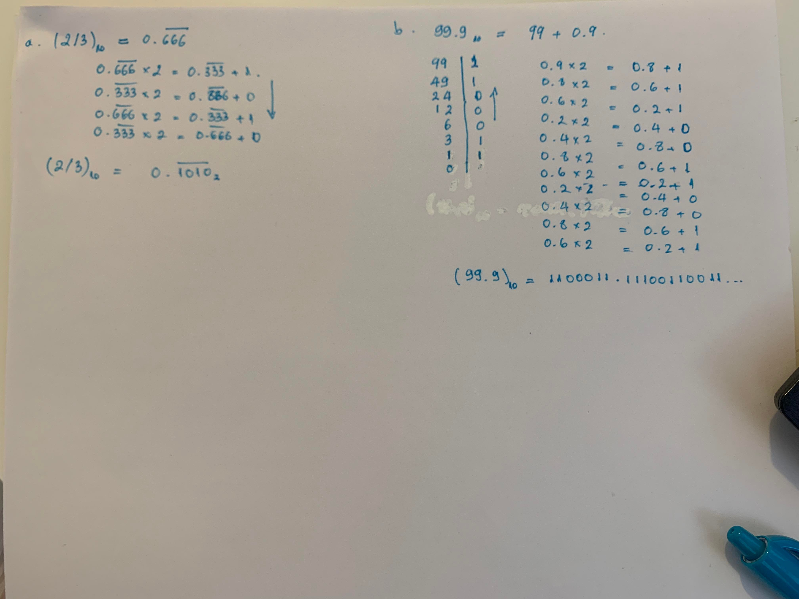
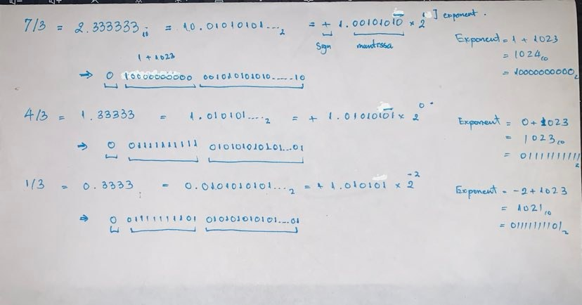

***Due Wednesday, February 9, 2022, 11:59PM. Please submit an html of your completed work on Moodle. If you wish to write things on paper to complement your typed work, you can either submit the hard copy in class on Thursday or you can upload a picture/scan of your work to Moodle.***

# Part I: Binary Numbers and Floating Point Representation

## Problem 1: Decimal to Binary Conversion

Convert the following base 10 numbers to binary:

(a) 2/3
(b) 99.9

Do all computations by hand.

::: answer

:::

## Problem 2: Determining Machine Epsilon

***Note: This is based on Exercise 9 of Section 0.3 of Sauer.***

(a) Write 7/3, 4/3, and 1/3 in binary and in their IEEE machine expressions.

    ::: answer
    
    :::

(b) Set `options(digits=20)` and calculate (7/3 - 4/3) - 1 on `R`.

    ::: answer
    ```{r}
    options(scipen=999)
    options(digits = 20)

    (7/3 - 4/3) - 1

    ```
    :::

(c) User your answer to (a) to explain why your answer to (b) gives $\epsilon_{\hbox{mach}}$. Recall that the command `.Machine$double.eps` will give you machine epsilon in `R`.

    ::: answer
    Technically the result should be 0 since $\frac{7 - 4}{3} - 1 = \frac{3}{3} - 1 = 0$. However, we have $2.2204460492503131\cdot10^{-16}$ instead. This is because how floating point numbers represented in computer memories. As shown in part (a), the mantissa part of $\frac{7}{3}$ end with 10 instead of 01 because of shifting while the mantissa part of $\frac{4}{3}$ end with 01. When performing the subtraction, the remaining is $(1\cdot2^{-52})_2$.

    ```{r}
    #  subtraction

    (7/3-4/3) - 1

    #  epsilon
    .Machine$double.eps

    #  remaining 0.0...01
    1*2^-52
    ```
    :::

(d) Does (4/3 - 1/3) - 1 also give $\epsilon_{\hbox{mach}}$? Explain by converting to floating point numbers and carrying out the machine arithmetic.

    ::: answer
    Without shifting, the mantissa part of $\frac{4}{3}$ and $\frac{1}{3}$ end with the same 01 making the subtraction goes directly to 0.
    :::

## Problem 3: Disappearing Act

Using `R`, compute: 1000000000000000000 + 100 - 1000000000000000000. What happens? Explain why this is.

::: answer
```{r}
1000000000000000000 + 100 - 1000000000000000000
```

The conversion from decimal to binary shows that the resulting addition should be $1000000000000000100_{10}$ or $110111100000101101101011001110100111011001000000000001100100_{2}$.

$$
\begin{align*}
1000000000000000000_{10} &= 110111100000101101101011001110100111011001000000000000000000_{2}\\
100_{10} &=  1100100_{2}\\
\hline
1000000000000000100_{10} &= 110111100000101101101011001110100111011001000000000001100100_{2}
\end{align*}
$$

However, the error occurs due to rounding error during the conversion to store information in IEEE754 Double precision 64-bit.

**Encoded as Binary of** $10^{18}$: $$
1\cdot10^{18} = 110111100000101101101011001110100111011001000000000000000000_{2}  \\
\downarrow \\
1.10111100000101101101011001110100111011001000000000000000000\cdot2^{59} \\
\downarrow \\
0\quad|\quad 10000111010\quad|\quad1011110000010110110101100111010011101100100000000000
$$ **Encoded as Binary of** $10^2$: $$
1\cdot10^{2} =  1100100_{2} \\
\downarrow \\
1.100100\cdot2^{6} \\
\downarrow \\
0\quad|\quad 10000000101\quad|\quad 1001000000000000000000000000000000000000000000000000\\
0.0.......1100100\cdot2^{6} \cdot2^{53} \\
\downarrow \\
0\quad|\quad 10000111010\quad|\quad 0000000000000000000000000000000000000000000000000001\\
$$ **Calculation using Encoded Binary:** $$
\begin{align*}
        1\cdot&10^{18} &\Rightarrow  0\quad|\quad 10000111010\quad|\quad 1011110000010110110101100111010011101100100000000000 \\
+ \quad 1\cdot&10^{2} &\Rightarrow   0\quad|\quad 10000111010\quad|\quad 0000000000000000000000000000000000000000000000000001 \\
\hline
&& 0\quad|\quad 10000111010\quad|\quad 1011110000010110110101100111010011101100100000000001 
\end{align*}\\
\downarrow\\
1.000000000000000128\cdot10^{18}
$$ Decode result from above calculation is $1.000000000000000128 \cdot 10^{18}$ and $1.000000000000000128\cdot10^{18} - 10^{18} = 128$.
:::

## Problem 4: Rounded Integers

Find the smallest positive integer $i$ such that $i$ is not exactly representable using the IEEE standard in double precision; i.e., $\hbox{fl}(i)\neq i$.

::: answer
There are 52 bits to store mantissa binary and one implied 1. Therefore, the we can represent number up to $2^{53}$ and the smallest not representable integer would be $2^{53}+ 1$.

```{r}
options(digits=22)
2^53
2^53 + 1
```
:::

# Part II: Linear Algebra Review

## Problem 5: Four Fundamental Subspaces

Let $$A=\begin{bmatrix} 1 & 2 & 1 & -3 & 2 \\  2 &  4 &  1 &-3 &  4 \\  1 &  2 & -2 &  6 &  4 \\
 3 &  6 &  2 & -6 & 0 \\
-1&-2& 3&-9& 3\\  0 &  0 & 1&-3& 4
 \end{bmatrix}.$$

(a) What is the rank of $A$?

    ::: answer
    The reduced row echelon form of $A$ has 3 non-zero rows.Therefore, the rank of $A$ is 3.

    ```{r}
    library(pracma)
    A = rbind(c(1,2 ,1, -3,2),
              c(2,4,1 ,-3 ,4),
              c(1,2, -2 ,6 ,4),
              c(3,6,2, -6 ,0 ),
              c(-1,-2,3,-9,3),
              c(0,0,1,-3,4))
    rref(A)

    ```
    :::

(b) For each of the four fundamental subspaces of $A$, give the dimension of the subspace and the dimension of the vector space in which the subspace resides.\

    ::: answer
    **Row Space**:

    -   dimension of subspace : 3
    -   dimension of vector space: 5

    **Column Space**:

    -   dimension of subspace : 3
    -   dimension of vector space: 6

    **Null Space of** $A$:

    -   dimension of subspace : 2
    -   dimension of vector space: 5

    **Null Space of** $A^{-T}$:

    -   dimension of subspace : 3
    -   dimension of vector space: 6
    :::

(c) Let $T(x)=Ax$. Is $T$ one-to-one? Briefly explain your answer.

    ::: answer
    $T(x)$ is not one-to-one because $T(x) = b$ has one or more solutions for $b$ since the columns of $A$ are not linearly independent.
    :::

## Problem 6: Solutions to $Ax=b$

Let $$A=\left[
\begin{array}{rrrrr}
%\begin{bmatrix}
 -2 & 1 & -5 & 1 & 2 \\
 1 & -1 & 3 & 0 & 0 \\
 -1 & 0 & -2 & 3 & -4 \\
 1 & 2 & 0 & -2 & 4 
\end{array}
\right]
,$$ and $T: {\mathbb{R}}^5 \rightarrow {\mathbb{R}}^4$ be the linear transformation given by $T(x)=Ax$.

(a) Let $y=\begin{bmatrix} -1 \\ 0 \\ -1 \\3\end{bmatrix}$. I have performed some row operations for you below on the augmented matrix $[A|y]$.

    $$
    [A|y] = \left[
    \begin{array}{rrrrr|r}
    %\begin{bmatrix}
     -2 & 1 & -5 & 1 & 2 & -1\\
     1 & -1 & 3 & 0 & 0 & 0\\
     -1 & 0 & -2 & 3 & -4 & -1\\
     1 & 2 & 0 & -2 & 4 & 3
    \end{array}
    \right]
    \xrightarrow{\hbox{row ops}}
    \left[
    \begin{array}{rrrrr|r}
     1 & 0 & 2 & 0 & 0 &1\\
     0 & 1 & -1 & 0 & 0 &1\\
     0 & 0 & 0 & 1 & 0 &0\\
     0 & 0 & 0 & 0 & 1 & 0
     \end{array}
    \right].  
    $$ 
    For each of the following statements, decide if the statement is TRUE (T), FALSE (F), or there is NOT ENOUGH INFORMATION TO DECIDE (I). *Briefly* justify your answers.

    (i) The columns of $A$ are linearly independent.
    (ii) The system of equations $Ax =y$ is consistent (i.e., it has at least one solution).
    (iii) For every $b \in {\mathbb{R}}^4$, the system of equations $Ax = b$ is consistent.
    (iv) The domain of the linear transformation $T$ is all of ${\mathbb{R}}^5$.
    (v) The linear transformation $T$ is onto.
    (vi) There are infinitely many solutions to $Ax = 0$.
    (vii) Any 4 columns of the original matrix $A$ form a basis for

    ::: answer
    (i). F\
    (ii). T\
    (iii).T\
    (iv). T\
    (v). T\
    (vi). T\
    (vii). F\
    :::

\

(b) Let $b = \left[ \begin{matrix} 4 \\ -2 \\ -6 \\ 7 \end{matrix} \right]$ and continue with the same $A$ from above. Given that $x = \left[ \begin{matrix} ,1 \\ 0 \\ -1 \\ -1 \\1 \end{matrix} \right]$ is a solution to $Ax = b$, describe (in parametric form) *all* solutions to $A x = b$.

    ::: answer
    
    **Approach 1:** \
    
    $$
    [A|b] = 
    \left[\begin{array}{rrrrr|r}
    %\begin{bmatrix}
     -2 & 1 & -5 & 1 & 2 & 4\\
     1 & -1 & 3 & 0 & 0 & -2\\
     -1 & 0 & -2 & 3 & -4 & -6\\
     1 & 2 & 0 & -2 & 4 & 7
    \end{array}
    \right]
    \xrightarrow{\hbox{row ops}}
     \left[
    \begin{array}{rrrrr|r}
     1 & 0 & 2 & 0 & 0 &-1\\
     0 & 1 & -1 & 0 & 0 &1\\
     0 & 0 & 0 & 1 & 0 &-1\\
     0 & 0 & 0 & 0 & 1 & 1
     \end{array}
    \right]
    $$

    $x_3$ is the free variable. Therefore, general solution to this equation can parametric form:

    $$
    \left[
    \begin{array}{r}
     -1\\
      1\\
      0\\
     -1\\
      1
     \end{array}
    \right] + 
    \left[
    \begin{array}{r}
     -2\\
      1\\
      1\\
     0\\
    0\\
    \end{array}
    \right]x_3
    $$

    To verify, we know that $x$ is a solution to $Ax= b$ which means there exist $x_3 = -1$ that

    $$
    \left[
    \begin{array}{r}
     -1\\
      1\\
      0\\
     -1\\
      1
     \end{array}
    \right] + \left[
    \begin{array}{r}
     -2\\
      1\\
      1\\
     0\\
    0
     \end{array}
    \right](-1) =  \left[
    \begin{array}{r}
     1\\
      0\\
      -1\\
     -1\\
    1
     \end{array}
    \right]
    $$

    ```{r}
        
        Ab = cbind(c(−2,1,−1,1), 
                   c(1,−1,0,2), 
                   c(−5,3,−2,0), 
                   c(1,0,3,−2), 
                   c(2,0,−4,4), 
                   c(4,-2,-6,7))
        
        rref(Ab)

    ```
    
    :::
    
    ::: answer
    
    **Approach 2:**\
    
    $$
    Ax = 0  \xrightarrow{\hbox{row ops}}
    \left[
    \begin{array}{rrrrr|r}
     1 & 0 & 2 & 0 & 0 \\
     0 & 1 & -1 & 0 & 0\\
     0 & 0 & 0 & 1 & 0\\
     0 & 0 & 0 & 0 & 1
     \end{array}
    \right]  
    $$ 
    has the parametric form of
    
    $$
    \left[
    \begin{array}{r}
     -2\\
      1\\
      1\\
     0\\
    0
     \end{array}
    \right]x_3
    $$
    
    so the solution for $Ax=b$ is 
    
     $$
    \left[
    \begin{array}{r}
     -2\\
      1\\
      1\\
     0\\
    0
     \end{array}
    \right]x_3
      + \left[ 
      \begin{matrix} 1 \\ 0 \\ -1 \\ -1 \\1 \end{matrix} \right]
    $$
    
    
    
    :::
