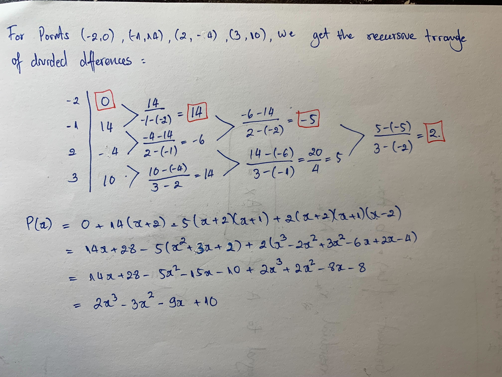

***Due Wednesday, March 30, 2022, 11:59PM. Please submit an html of your completed work on Moodle. If you wish to write things on paper to complement your typed work, you can either submit the hard copy in class on Thursday or you can upload a picture/scan of your work to Moodle.***

The following line sources functions from the class file `365Functions.r`. Feel free to use any of these functions throughout the semester.

```{r message=FALSE, warning=FALSE, include=FALSE}
source('https://www.macalester.edu/~dshuman1/365/365Functions.r')
require(Matrix)
require(ggplot2)
knitr::opts_knit$set(message=FALSE, warning=FALSE)
```

# Problem 1: Polynomial Interpolation

**Note: The first three parts of this question are from Activity 13**

Consider the points (-2,0), (-1,14), (2,-4), (3,10). Find the degree 3 (i.e., the highest order term is $cx^3$) interpolating polynomial p(x) for these points in three different ways.

a)  Calculate the Vandermonde matrix and solve the equation for the coefficients using `R`'s built-in `solve` function.

::: answer
```{r}
p1_x = c(-2,-1,2,3)
p1_y = c(0,14,-4,10)
(p1_vandermonde_matrix = Vandermonde(p1_x))
solve(p1_vandermonde_matrix, p1_y)
```
:::

b)  By hand, find the interpolating polynomial using Newton's divided differences. You need to multiply it out to see that you are getting the same answer as above.

::: answer

:::

c)  Let $x=(-2,-1,2,3)$. Plot the four Lagrange polynomials $L_i(x)$ for $i=1,2,3,4$. Check that the interpolating polynomial you computed in the first two parts of this problem is equal to

$$ p(x) = 0 \cdot L_1(x) + 14 \cdot L_2(x) + (-4)\cdot L_3(x) + 10 \cdot L_4(x).$$

::: answer
```{r}
    l1 = function(x){
      return(
        ((x - p1_x[2])*(x - p1_x[3])*(x - p1_x[4]))/((p1_x[1] - p1_x[2])*(p1_x[1] - p1_x[3])*(p1_x[1] - p1_x[4]))
      )
    }
    l2 = function(x){
      return(
        ((x - p1_x[1])*(x - p1_x[3])*(x - p1_x[4]))/((p1_x[2] - p1_x[1])*(p1_x[2] - p1_x[3])*(p1_x[2] - p1_x[4]))
      )
    }
    l3 = function(x){
      return(
        ((x - p1_x[2])*(x - p1_x[1])*(x - p1_x[4]))/((p1_x[3] - p1_x[2])*(p1_x[3] - p1_x[1])*(p1_x[3] - p1_x[4]))
      )
    }
    l4 = function(x){
      return(
        ((x - p1_x[2])*(x - p1_x[3])*(x - p1_x[1]))/((p1_x[4] - p1_x[2])*(p1_x[4] - p1_x[3])*(p1_x[4] - p1_x[1]))
      )
    }
    
    
```

```{r}
    X <-data.frame(x = p1_x, i_1 = c(1,0,0,0),i_2 = c(0,1,0,0), i_3 = c(0,0,1,0), i_4 = c(0,0,0,1))

    ggplot(X, aes(x))+ 
      stat_function(fun=function(x) l1(x), aes(color = 'i=1')) +
      stat_function(fun=function(x) l2(x), aes(color = 'i=2')) +
      stat_function(fun=function(x) l3(x), aes(color = 'i=3')) +
      stat_function(fun=function(x) l4(x), aes(color = 'i=4')) +
      geom_point(aes(y= i_1, color = 'i=1'))+
      geom_point(aes(y= i_2, color = 'i=2'))+
      geom_point(aes(y= i_3, color = 'i=3'))+
      geom_point(aes(y= i_4, color = 'i=4'))+
      ylim(-2, 2) +
      labs(x='values of x',
           y = 'values of y', 
           title='Lagrange polynomials for various  i')+
      scale_color_manual(name = "L_i(x)",
                         values = c('red', 'purple', 'blue', 'brown'), 
                         labels = c('i=1', 'i=2', 'i=3', 'i=4'))
    
    
```
:::

\

d)  In `365Functions.r`, I have included a function `Interpolator` that does polynomial interpolation using either the Vandermonde matrix or Newton's divided difference method. In theory, these two methods should yield the same interpolating polynomial (which is unique as long as the interpolation points are at different x values). Have a quick look at my code to understand what it is doing. Then find an example where the two methods give two different answers or one method finds an answer and the other does not. Explain the discrepancy.

::: answer
With more data points, 25 in the example below, the Vandermonde interpolation method encounters error due to the fact that the Vandermonde matrix being invertible or the matrix has linearly dependent columns.

```{r}
p1d_x = c(-94,146,49,75,-58,108,-89,43,22,110,120,-133,-24,91,52,-10,-20,9,-71,57,107,36,94,-59,95)
p1d_y = c(-119,124,-142,90,-68,-87,-138,-53,-107,134,-26,29,-3,-114,96,85,-41,106,-81,132,42,-138,-12,48,-98)


p1d_xx = seq(min(p1d_x),max(p1d_x), length=1000)


p1d_p_newtonDD = Interpolator(p1d_x,p1d_y, p1d_xx, Itype = 'NewtonDD')
#  With will casue error
# p1d_p_vandermonde = Interpolator(p1d_x,p1d_y, p1d_xx, Itype = 'Vandermonde')

```

The Vandermondematrices tend to be badly ill-conditioned meaning that the matrices are likely to be singular. The ill-conditioned means that a small change in the constant coefficients results in a large change in the solution that the answer is not even reliable.

```{r}
#  Big condition number
Cond(Vandermonde(p1d_x))
```
:::

\

# Problem 2: Choosing Interpolation Points

Here is the function $f(x) = \frac{1}{1+2x}$ on the interval $[0,10]$:

```{r}
f <- function(x){1/(1+2*x)}
a <- 0
b <- 10
xx <- seq(a,b,length=1000)
yf <- f(xx)
plot(xx,yf,type='l',xlab="x",ylab="y",xlim=c(a,b),ylim=c(0,1),col='black',lwd=2)
```

a)  Use 5 evenly spaced nodes on the interval [0,10] to generate a polynomial interpolant $p_{e5}(x)$ of $f(x)$ on this interval (you can again use my `Interpolator` function). Make a plot with the graph of the function $f(x)$ in black, the graph of the interpolating polynomial in blue, and the 5 interpolating points in red.

::: answer
```{r}
p2a_evenly_5_spaced_x = seq(0,10, length=5)
p2a_evenly_5_spaced_y = f(p2a_evenly_5_spaced_x)

p2a_p_e5 = Interpolator(p2a_evenly_5_spaced_x,p2a_evenly_5_spaced_y, xx)

plot(xx,yf,type='l',xlab="x",ylab="y",xlim=c(a,b),ylim=c(0,1),col='black',lwd=2)
lines(xx,p2a_p_e5,type='l',col='blue',lwd=2)
points(p2a_evenly_5_spaced_x, p2a_evenly_5_spaced_y,col='red', pch=16 )
```
:::

b)  Repeat part a) with 10 evenly spaced nodes on the interval [0,10].

::: answer
```{r}
p2b_evenly_10_spaced_x = seq(0,10, length=10)
p2b_evenly_10_spaced_y = f(p2b_evenly_10_spaced_x)

p2b_p_e10 = Interpolator(p2b_evenly_10_spaced_x,p2b_evenly_10_spaced_y, xx)

plot(xx,yf,type='l',xlab="x",ylab="y",xlim=c(a,b),ylim=c(0,1),col='black',lwd=2)
lines(xx,p2b_p_e10,type='l',col='blue',lwd=2)
points(p2b_evenly_10_spaced_x, p2b_evenly_10_spaced_y,col='red', pch=16)
```
:::

c)  Find the zeros of a degree 5 Chebyshev polynomial (shifted and stretched to cover the interval [0,10]). Repeat part a) using these 5 nodes to generate a polynomial interpolant $p_{c5}(x)$ of $f(x)$ on this interval (you can again use my `Interpolator` function).

::: answer
$T_n(k) = 0$ at $k_i= cos(\frac{2i - 1}{2n} \pi )$ on an interval $[-1, 1]$ . For $n=5$, we get $k_i = \{cos(\frac{\pi}{10}), cos(\frac{3\pi}{10}), cos(\frac{\pi}{2}), cos(\frac{7\pi}{10}), cos(\frac{9\pi}{10})\}$ for $i \in \{1,2,3,4,5\}$.

However, for the given interval between $A=0$ and $B=10$, the corresponding $y=T_5(\frac{2}{B-A}(x - \frac{A+B}{2}))= T_5(\frac{x-5}{5})$. Then we have $k_i = \frac{x-5}{5}$ and $x \in \{ 5cos(\frac{\pi}{10}) + 5, 5cos(\frac{3\pi}{10}) + 5, 5cos(\frac{\pi}{2}) + 5, 5cos(\frac{7\pi}{10}) + 5, 5cos(\frac{9\pi}{10}) + 5\}$

```{r}
p2c_chebyshev_5_k = c(cos(pi/10),cos(3*pi/10), 0,cos(7*pi/10), cos(9*pi/10))
(p2c_chebyshev_5_x = 5*p2c_chebyshev_5_k + 5)
(p2c_chebyshev_5_y = f(p2c_chebyshev_5_x))
```

```{r}

p2c_p_c5 = Interpolator(p2c_chebyshev_5_x,p2c_chebyshev_5_y, xx)

plot(xx,yf,type='l',xlab="x",ylab="y",xlim=c(a,b),ylim=c(0,1),col='black',lwd=2)
lines(xx,p2c_p_c5,type='l',col='blue',lwd=2)
points(p2c_chebyshev_5_x, p2c_chebyshev_5_y,col='red', pch=16)
points(p2c_chebyshev_5_x, rep(0,length(p2c_chebyshev_5_x)))
```
:::

d)  Repeat part c) with the zeros of a degree 10 Chebyshev polynomial.

::: answer
```{r}

chebyshev_nodes = function(n){
  nodes = c()
  for(i in 1:n){
    nodes = c(nodes, cos((2*i - 1)*pi/(2*n)))
  }
  return(nodes)
}

(p2d_chebyshev_10_x = 5*chebyshev_nodes(10) + 5)
(p2d_chebyshev_10_y = f(p2d_chebyshev_10_x))

```

```{r}

p2d_p_c10 = Interpolator(p2d_chebyshev_10_x,p2d_chebyshev_10_y, xx)

plot(xx,yf,type='l',xlab="x",ylab="y",xlim=c(a,b),ylim=c(0,1),col='black',lwd=2)
lines(xx,p2d_p_c10,type='l',col='blue',lwd=2)
points(p2d_chebyshev_10_x, p2d_chebyshev_10_y,col='red', pch=16)
points(p2d_chebyshev_10_x, rep(0, 10))
```
:::

e)  Compare the errors $||f-p||_{\infty}$ for each of these four approximating polynomials on the interval $[0,10]$. You can approximate these errors by finding the maximum absolute value of the differences between the function and the approximating polynomial on the 1000 evenly spaced points you used to plot the function. Here is an example:

<!-- -->

    err <- yf - yc5
    print("Chebyshev Degree 5 Error:")
    print(max(abs(err)))

::: answer
```{r}
p_e5_error = yf - p2a_p_e5 

p_e10_error = yf - p2b_p_e10

p_c5_error = yf - p2c_p_c5

p_c10_error = yf - p2d_p_c10

print(paste("Evenly Space 5 points Error:", max(abs(p_e5_error))))
print(paste("Evenly Space 10 points  Error:", max(abs(p_e10_error))))
print( paste("Chebyshev Degree 5 Error:", max(abs(p_c5_error))))
print(paste0("Chebyshev Degree 10 Error:",max(abs(p_c10_error))))

```
:::

f)  Show the errors from parts b) and d) on a single plot. Comment on the plot.

::: answer
The error from the interpolation using Chebyshev degree 10 oscillates more frequently at higher amplitude. At the curve with steep slope, at the smaller x values between 0 and 1, the magnitude of the error from this interpolation is less than that of the error at from the interpolation using 10 evenly spaced points.

The 10 evenly spaced points interpolation gives error with much higher magnitude at the steeper curves for x between 0 and 1. However, the magnitude of the error quickly decreases to near 0 and stable around 0 with less oscillation.

```{r}

ggplot() + 
  geom_point(aes(x = xx, y= p_e10_error, color="even")) +
  geom_point(aes(x = xx, y= p_c10_error, color="cheb"))+
  geom_hline(yintercept = 0, color='blue')+
   scale_color_manual(name = "Error",
                         values = c('even'= 'red', "cheb"='purple'), # Color     specification
                         labels = c('even'='10 evenly spaced points', 'cheb'='Chebyshev Degree 10'))+
      labs(x='X', 
           y = 'Error',
           title='Interpolation Approximate Error') + 
  theme(legend.position = 'top')

  
```
:::

g)  On a single plot, show the errors from parts b) and d) divided by the function values `yf`. Comment on the plot.

::: answer
The graph show that the Chebyshev interpolation gives greater yet consistent maximum error ratio amplitude throughout the interval. On the other hand, the interpolation using 10 evenly spaced points gives lower error ratio amplitude throughout the middle section of interval between 1 to 9 but it gives higher error ratio amplitude at the edges of the interval.

```{r}

ggplot() + 
  geom_point(aes(x = xx, y= p_e10_error/yf, color="even")) +
  geom_point(aes(x = xx, y= p_c10_error/yf, color="cheb"))+
  geom_hline(yintercept = 0, color='blue')+
  theme(legend.position = 'top')+
  scale_x_continuous(breaks=0:10)+
  scale_color_manual(name = "Error",
                         values = c('even'= 'red', "cheb"='purple'), # Color     specification
                         labels = c('even'='10 evenly spaced points', 'cheb'='Chebyshev Degree 10'))+
  labs(x='X', y = 'Error',title='Interpolation Approximate Error') 

```
:::

\

# Problem 3: Extrapolation

Here is the data from Computer Problem 3.2.3 in the book on total world oil production in millions of barrels per day between 1994 and 2003.

```{r}
year <- seq(1994,2003)
bbld <- c(67.052,68.008,69.803,72.024,73.400,72.063,74.669,74.487,74.065,76.77) 
print(cbind(year,bbld))
plot(year,bbld,col='red',pch=20,cex=1.5,ylab="bbl/day(in millions)")
```

Our objective is to interpolate a function to fit this data and then extrapolate that function to predict the total world oil production in 2010.

a)  Generate three different interpolating functions and plot all three functions on the same graph, with a range of 1994 to 2014.:

-   the exact polynomial interpolant (you can use my `Interpolator` function)

-   a natural cubic spline (you can use `R`'s built-in `splinefun` function with `method="natural"`)

-   a not-a-knot cubic spline (you can use `R`'s built-in `splinefun` function with `method="fmm"`)

::: answer
```{r}
p3_xx = seq(1994, 2003, length=1000)
p3a_exact = Interpolator(year,bbld,p3_xx)
```

```{r}
p3a_ns_spline = splinefun(year, bbld, method="natural")
```

```{r}
p3a_nk_spline = splinefun(year, bbld, method="fmm") 
```

```{r}
ggplot() +  
geom_line(aes(y = p3a_exact, x = p3_xx, color = 'exact')) +
geom_line(aes(x = p3_xx,y = p3a_ns_spline(p3_xx), color = 'natural')) + 
geom_line(aes(x = p3_xx,y = p3a_nk_spline(p3_xx), color = 'not-a-knot')) + 
geom_point(aes(x=year, y = bbld), color = 'red')+
labs(x = 'Years', 
     y = 'bbl/day(in millions)', 
     title= " Interpolate functions for World Oil Production", 
     subtitle= "between 1994 to 2003")+
theme(legend.position = 'top')+
scale_color_manual(name = "Interpolating functions ",
                         values = c('exact'='purple', 
                                    'natural'='red', 
                                    'not-a-knot'='blue'), # Color     specification
                         labels = c('natural'='Natural Spline',
                                    'not-a-knot'='Not-a-knot Spline', 
                                    'exact'='Exact Polynomial Interpolan'))
  
  
```
:::

b)  Compute the three different predicted values for total world oil production in millions of barrels per day in 2010.

::: answer
```{r}
(p3b_exact_prediction = Interpolator(year,bbld,2010))
(p3b_ns_prediction = p3a_ns_spline(2010))
(p3b_nk_prediction = p3a_nk_spline(2010))

```
:::

c)  *Briefly* state which method you think is the best of the three, and why.

::: answer
I think the natural spline is the best one because it give the most reasonable estimation for 2010. The natural spline predicts a linear increase while the FMM suggests exponential increase in oil production.

```{r echo=FALSE}
p3_xxx = seq(1994, 2012, length=1000)

p3a_exact = Interpolator(year,bbld,p3_xxx)

ggplot() + 
geom_line(aes(x = p3_xxx,y = p3a_exact,  color = 'exact')) +
geom_line(aes(x = p3_xxx,y = p3a_ns_spline(p3_xxx), color = 'natural')) + 
geom_line(aes(x = p3_xxx,y = p3a_nk_spline(p3_xxx), color = 'not-a-knot')) + 
geom_point(aes(x=year, y = bbld), color = 'red')+
ylim(0,150)+
scale_x_continuous(breaks = 1994:2012)+
labs(x = 'Years', 
     y = 'bbl/day(in millions)', 
     title= " Interpolate functions for World Oil Production", 
     subtitle= "between 1994 to 2012")+
theme(legend.position = 'top')+
scale_color_manual(name = "Interpolating functions ",
                         values = c('exact'='purple', 
                                    'natural'='red', 
                                    'not-a-knot'='blue'), # Color     specification
                         labels = c('natural'='Natural Spline',
                                    'not-a-knot'='Not-a-knot Spline', 
                                    'exact'='Exact Polynomial Interpolan'))
```
:::

d)  What was the actual total world oil production in 2010?

::: answer
In 2010, global crude oil production stood at 86 million barrels daily
:::

\

# Problem 4: Numerical Integration

In Technical Report 1, some of you explored numerical differentiation via finite difference approximations. In this question, we are going to explore numerical integration (also called *quadrature*) using ideas we've learned about function approximation and polynomial interpolation. We want to approximate the integral $$ \int_a^b f(x) dx.$$

We'll consider three different methods. The main idea behind the first two methods is that we are going to approximate the function $f(\cdot)$ by a polynomial of degree $n-1$ passing through $n$ sampled points of the function. We'll compare two different choices for the $x$-values of the points: (i) the $n$ roots of the Chebyshev polynomial $T_n(x)$, stretched and shifted to cover the interval $[a,b]$; and (ii) the $x$-values of the $n$ extrema (minima and maxima) of the Chebyshev polynomial $T_{n-1}(x)$, stretched and shifted to cover the interval $[a,b]$. Note that the Chebyshev polynomial $T_n(x)$ has $n+1$ extrema, so that is why we are using $T_{n-1}(x)$ to find the locations of $n$ extrema.

a)  Write two functions `cheb.zeros(a,b,n)` and `cheb.extrema(a,b,n)` that return the desired $x$-values of $n$ interpolation points for each of these methods.

Run these commands to test your functions by generating 5 points on the interval $[2,6]$:

    cheb.zeros(2,6,5)
    cheb.extrema(2,6,5)

::: answer
```{r}
cheb.zeros = function(a,b,n){
  nodes = c()
  inverse_amplifier = (b-a)/2
  shifter = (a+b)/2
  for(k in 1:n){
    x = cos((2*k - 1)*pi/(2*n))
    nodes = c(nodes, x*inverse_amplifier + shifter)
  }
  return(nodes)
}


cheb.extrema = function(a,b,n){
  nodes = c()
  inverse_amplifier = (b-a)/2
  shifter = (a+b)/2
  for(k in 1:n-1){
    xtrema = cos(k*pi/(n-1))
    nodes = c(nodes, xtrema*inverse_amplifier + shifter)
  }
  return(nodes)
}

```

```{r}
cheb.zeros(2,6,5)
cheb.extrema(2,6,5)
```
:::

b)  I've started a function `cheb.integrate(f,a,b,n,method)` for you that should take a function, an interval, a number of interpolation points, and the method (zeros or extrema), and return an approximation of the definite integral $\int_a^b f(x) dx$. After calling your functions from part (a) to get the interpolation points, you need to (i) compute the coefficients of the interpolating polynomial, and (ii) use the coefficients to compute the integral of the interpolating polynomial over the interval $[a,b]$. For the first part of the task, you are allowed to use the Vandermonde matrix. Even though it is not particularly scalable and it would be better to use Newton's divided differences, it is more straightforward to code the interpolation with the Vandermonde matrix.

    As an aside, in practice, neither the Vandermonde or Newton's divided difference methods are used. Rather, the integral is approximated by the sum $\sum_{i=0}^{n-1} w_i f(x_i)$, where the $w_i$'s are some weights that can be calculated ahead of time in a fast manner.

    For the second part of the task, you should use your calculus knowledge about the closed form of an integral of a polynomial over an interval.

        cheb.integrate <- function(f,a,b,n,method='extrema'){
          if(method=='extrema'){
            x <- cheb.extrema(a,b,n)
          }
          else if(method=='zeros'){
            x <- cheb.zeros(a,b,n)
          }
          else{stop('Uknown method')}

          # Fill in your code here to (i) find the coefficients of interpolating polynomial and (ii) use them to compute the integral of the interpolating polynomial over the interval [a,b]
          # Hint: my code here is 4 lines

        }

    Test your code on $\int_{-1}^2 x^2~dx$ with 5 points:

        f <- function(x){x^2}
        cheb.integrate(f,-1,2,5,method='extrema')
        cheb.integrate(f,-1,2,5,method='zeros')

::: answer
```{r}
VandermondeInterpolator_custom =function(x,y, display.plot=TRUE) {
  n <- length(x)
  V <- Vandermonde(x)
  c <- solve(V,y)
  p <- function(z) { 
    Horner(c,z)
    #c %*% z^(0:(length(c)-1)) this alternative is just fine as well
  }  
  xx <- seq(min(x)-1,max(x)+1,length=1000)
  yy <- p(xx)
  if(display.plot == TRUE){
    plot(xx,yy,type='l',col='blue',xlab="x",ylab="y")
    points(x,y,pch=20,col='red')  
  }
  return(list(coeffs=c,interpolant=p))
}

cheb.integrate <- function(f,a,b,n,method='extrema', display.plot=TRUE){
  if(method=='extrema'){
    x <- cheb.extrema(a,b,n)
  }
  else if(method=='zeros'){
    x <- cheb.zeros(a,b,n)
  }
  else{stop('Uknown method')}
  
  # Fill in your code here to (i) find the coefficients of interpolating polynomial and (ii) use them to compute the integral of the interpolating polynomial over the interval [a,b]
  # Hint: my code here is 4 lines
  
  VandermondeInterpolation = VandermondeInterpolator_custom(x, f(x), display.plot = display.plot)
  result = integrate(VandermondeInterpolation$interpolant, lower = a, upper = b)
  
  return(result$value)
  
}
```

```{r}

f <- function(x){x^2}
cheb.integrate(f,-1,2,5,method='extrema')
cheb.integrate(f,-1,2,5,method='zeros')

        
```
:::

c)  In the third method, called Simpson's Rule, we take $n$ evenly spaced points ($n$ should be an odd integer), with the first equal to $a$ and the last equal to $b$. Then we create a quadratic spline, with one quadratic function fit through the points $x_0$, $x_1$, and $x_2$, the next fit through the points $x_2$, $x_3$, and $x_4$, and so forth. The figure below, which is from <http://tutorial.math.lamar.edu/Classes/CalcII/ApproximatingDefIntegrals.aspx>, shows a picture demonstrating this process with $n=7$.


Note that the black lines on top of the shaded areas are each quadratic functions passing through three points of the red function, which is the function we are approximating. The first quadratic goes through the points $(x_0,f(x_0))$, $(x_1,f(x_1))$, and $(x_2,f(x_2))$, and the area under it is shaded in green. The second quadratic goes through the points $(x_2,f(x_2))$, $(x_3,f(x_3))$, and $(x_4,f(x_4))$, and the area under it is shaded in beige. The third quadratic (the easiest to recognize as a quadratic) goes through the points $(x_4,f(x_4))$, $(x_5,f(x_5))$, and $(x_6,f(x_6))$, and the area under it is shaded in blue. The integral $\int_{x_0}^{x_6} f(x) dx$ is approximated by the sum of the green, beige, and blue areas.

Using the Lagrange form of the interpolating quadratic between the first three points, we have $$ p_1(x)=f(x_0)\frac{(x-x_1)(x-x_2)}{(x_0-x_1)(x_0-x_2)}+f(x_1)\frac{(x-x_0)(x-x_2)}{(x_1-x_0)(x_1-x_2)}+f(x_2)\frac{(x-x_0)(x-x_1)}{(x_2-x_0)(x_2-x_1)}.$$

If we let $h=x_{i+1}-x_{i}$ (the distance between any two of the evenly spaced points), then this becomes $$ p_1(x)=f(x_0)\frac{(x-x_1)(x-x_2)}{2h^2}-f(x_1)\frac{(x-x_0)(x-x_2)}{h^2}+f(x_2)\frac{(x-x_0)(x-x_1)}{2h^2},$$

and

```{=tex}
\begin{align*}
\int_{x_0}^{x_2}p_1(x)dx&=\frac{f(x_0)}{2h^2}\int_{x_0}^{x_2}(x-x_1)(x-x_2)dx-\frac{f(x_1)}{h^2}\int_{x_0}^{x_2}(x-x_0)(x-x_2)dx+\frac{f(x_2)}{2h^2}\int_{x_0}^{x_2}(x-x_0)(x-x_1)dx\\
&=\frac{h}{3}f(x_0)  + \frac{4h}{3}f(x_1)+\frac{h}{3}f(x_2) \\
&= \frac{h}{3}\left[f(x_0)+4f(x_1)+f(x_2)\right].
\end{align*}
```
So to approximate the integral, we can sum over each of the $\frac{n-1}{2}$ quadratic segments:

$$
\int_{a}^{b}f(x)dx \approx \sum_{k=1}^{\frac{n-1}{2}} \int_{x_{2(k-1)}}^{x_{2k}}p_k(x)dx=
\sum_{k=1}^{\frac{n-1}{2}} \frac{h}{3}\left[f(x_{2(k-1)})+4f(x_{2k-1})+f(x_{2k})\right],
$$

where $k$ indexes the quadratic segments. Note that the right-hand side is just a linear combination of the function values at the $n$ evenly spaced points!

Implement a function `simpson.integrate` that takes a function $f$, an interval $[a,b]$, and an odd number of points $n$, and approximates $\int_{a}^{b}f(x)dx$ by the sum on the right-hand side of the most recent equation above.

    simpson.integrate <- function(f,a,b,n){
    if(n%%2==0)
      stop('n must be odd')
    # fill in the rest of the function here
    }

Test your `simpson.integrate` code on the integral $\int_0^1 x^{1.5}dx$, with $n=7$ points (i.e., an approximation comprised of three quadratic functions concatenated):

    g <- function(x){x^1.5}
    simpson.integrate(g,0,1,7)

::: answer
```{r}
simpson.integrate <- function(f,a,b,n){
  if(n%%2==0)
    stop('n must be odd')
  # fill in the rest of the function here
  
  estimate = 0
  h = (b-a)/(n-1)
  x = seq(a,b, length=(n))

  
  for(k in 1:((n-1)/2)){
    #  The index given by the seq() is 1-index while the formula is 0-index so need to add 1 to formula
    estimate = estimate + (h/3)*(f(x[2*(k-1) + 1]) + 4*f(x[2*k]) + f(x[2*k + 1]))
  }
  return(estimate)
}
```

```{r}
# Test
g <- function(x){-cos(3*x^(2))+3*sin(x)} 
(simpson.integrate(g,0,3,7))

```
:::

d)  For any good numerical integration method, the magnitude of the error between the actual definite integral value and the approximation should decrease as the number of integration points/sub-intervals you use for the approximation increases. Here is a function to plot the magnitudes of the errors for different values of $n$ and for each of the three methods you implemented above. The parameter `correct` is the actual value of the integral of $f$ over the interval $[a,b]$. You can compute this analytically by hand (woohoo!) or using Wolfram Alpha.

<!-- -->

    integration.test <- function(f,a,b,max.n,correct){
      nn.odd <- seq(3,max.n,by=2)
      nn <- 2:max.n
      
      # Compute the errors
      # Note: I added machine epsilon to all errors so that the plots will still work if the actual error is exactly equal to 0
      errors.zeros <- rep(NA,length(nn))
      errors.extrema <- rep(NA,length(nn))
      errors.simpson <- rep(NA,length(nn.odd))
      for (i in 1:length(nn)){
        errors.zeros[i]<-abs(cheb.integrate(f,a,b,nn[i],method='zeros')-correct)+.Machine$double.eps
        errors.extrema[i]<-abs(cheb.integrate(f,a,b,nn[i],method='extrema')-correct)+.Machine$double.eps
      }
      for (i in 1:length(nn.odd)){
        errors.simpson[i]<-abs(simpson.integrate(f,a,b,nn.odd[i])-correct)+.Machine$double.eps
      }
      
      # Plot the error magnitudes
     plot(nn,errors.zeros,log="y",type="l",lwd=3,col="blue",xlab="n",ylab="Error Magnitude",ylim=range(errors.zeros,errors.extrema,errors.simpson))
      points(nn,errors.zeros,log="y",pch=19,col="blue",)
      lines(nn,errors.extrema,log="y",type="l",lwd=3,col="DodgerBlue")
      points(nn,errors.extrema,log="y", pch=19,col="DodgerBlue",)
      lines(nn.odd,errors.simpson,log="y",type="l",lwd=3,col="DarkOrange")
      points(nn.odd,errors.simpson,log="y",pch=19,col="DarkOrange")
      
    }

```{r include=FALSE}
integration.test <- function(f,a,b,max.n,correct, display.all=FALSE){
      nn.odd <- seq(3,max.n,by=2)
      nn <- 2:max.n
      
      # Compute the errors
      # Note: I added machine epsilon to all errors so that the plots will still work if the actual error is exactly equal to 0
      errors.zeros <- rep(NA,length(nn))
      errors.extrema <- rep(NA,length(nn))
      errors.simpson <- rep(NA,length(nn.odd))
      for (i in 1:length(nn)){
        errors.zeros[i]<-abs(cheb.integrate(f,a,b,nn[i],method='zeros', display.plot=display.all)- correct)+.Machine$double.eps
        errors.extrema[i]<-abs(cheb.integrate(f,a,b,nn[i],method='extrema',display.plot=display.all)-correct)+.Machine$double.eps
      }
      for (i in 1:length(nn.odd)){
        errors.simpson[i]<-abs(simpson.integrate(f,a,b,nn.odd[i])-correct)+.Machine$double.eps
      }
      

      ggplot() +
        geom_line(aes(x= nn, y = errors.zeros, color = 'zeros')) +
        geom_point(aes(x=nn, y= errors.zeros, color = 'zeros')) +
        geom_line(aes(x= nn, y = errors.extrema, color = 'extrema')) +
        geom_point(aes(x= nn, y = errors.extrema, color = 'extrema')) +
        geom_line(aes(x= nn.odd, y = errors.simpson, color = 'simpson')) +
        geom_point(aes(x=nn.odd, y= errors.simpson, color = 'simpson')) +
        scale_x_continuous(breaks = 0:max.n) + 
        scale_y_log10()+
        labs(
          x = 'n',
          y = 'Error Magnitude',
          title = "The error magnitudes"
        ) +
        theme(legend.position = 'top') +
        scale_color_manual(
          name = "Error",
          values = c('zeros' = 'blue',
                     'extrema' = 'DodgerBlue',
                     'simpson' = 'DarkOrange'),
          labels = c('zeros' = 'Natural Spline',
                     'extrema' = 'Not-a-knot Spline',
                     'simpson'='Exact Polynomial Interpolan'))

    }
```

Here is an example:

    g <- function(x){cos(2*pi*x)+cos(6*pi*x)}
    xx <- seq(0,.75,length=1000)
    plot(xx,g(xx),type='l',lwd=3,col="red",xlab="x",ylab="g(x)")
    integration.test(g,0,.75,19,-1/(3*pi))

Choose some integrals that are interesting to you and test out the performance of the three methods. How do they compare? Is one always the best? Try it for a function that is not as smooth. How does the smoothness affect the convergence? Do you run into computational problems if you try to make $n$ too large? If so, this is due to our use of the Vandermonde instead of the more efficient implementation discussed in the footnote above. You do not have to answer all of these questions comprehensively. I just want you to try a few examples to provoke some thought about the different methods, as well as to double check that your code is working correctly.

::: answer


I tried two functions that are not polynomial to see how the interpolation find the estimate within a given interval. Both of the splines seems to outperform the exact interpolation method and converge faster. 
The more the number of n the smaller the  magnitude of the error between the actual definite integral value and the approximation. However, due to the ill-conditioning that come with the Vandermonde matrices, we cannot increase the value of $n$ above 20.

In the second function, $sin^2(\pi x)+cos(3\pi x)+2$, seems to give an interesting scenario when the exact interpolation method outperform both of the spline methods even at bigger $n$ value. I do not know why this happen.

```{r}
g <- function(x){-cos(2*x) + sin(x*pi) + 4}
xx <- seq(0,5,length=1000)
plot(xx,g(xx),type='l',lwd=3,col="red",xlab="x",ylab="g(x)")
integration.test(g,0,5,15, 20.90863, display.all = FALSE)
```


```{r}
g <- function(x){(sin(pi*x))^2+cos(3*pi*x)+2}
xx <- seq(0,1,length=1000)
plot(xx,g(xx),type='l',lwd=3,col="red",xlab="x",ylab="g(x)")
integration.test(g,0,1,19,2.5, display.all = FALSE)
```


:::

\

# Problem 5: Two Options

**For the final problem, choose one of the following two options.** [You are of course welcome to try both.]

\

## Problem 5a: Bezier Curves

Design your own cool and interesting letter or symbol using Bezier curves. See Activity A14 for an example. Feel free to use interesting colors for the borders or fills of your letter, although you are not required to do so if you going for a different aesthetic.

::: answer
```{r}
library(manipulate)
source("https://www.macalester.edu/~dshuman1/365/365Functions.r")
```

```{r}
L_heart <- rbind(
  c(140,20,73,20 ,20,74, 20,140),
  c(20, 140, 20, 275, 156, 310, 248, 443), 
  c( 248 ,443 ,336, 311, 477, 270, 477, 140), 
  c(477 ,140 ,477,  74, 423 , 20, 357,  20), 
  c(357 , 20 ,309,  20, 267,  48, 248 , 89), 
  c(248 , 89, 229 , 48 ,188 , 20, 140 , 20)
  )

a = spMatrix(6,8, 
             i= c(rep(1:6, each=4),rep(1:6,each=4)),
             j =c(rep(rep(seq(1,7,2), 6)),rep(seq(2,8,2), 6)), 
             x =c(rep(1,24),rep(-1,24)))

U_heart = L_heart*a

L <- U_heart
pts1 <- draw.beziers(L[, 1], L[, 3], L[, 5], L[, 7], L[, 2],L[, 4], L[, 6], L[, 8], npts = 10)
L <- L_heart
pts2 <- draw.beziers(L[, 1], L[, 3], L[, 5], L[, 7], L[, 2],L[, 4], L[, 6], L[, 8], npts = 10)

ggplot()+
  geom_polygon(aes(x = pts1$x, y = pts1$y), fill = rgb(0.9,0.1,0, alpha = 0.5)) + 
  geom_polygon(aes(x = pts2$x, y = pts2$y), fill = rgb(0,0.1,0, alpha = 0.5)) + 
  coord_fixed(ratio = 1) + 
  labs(x = element_blank() , y=element_blank())
  
```
:::

\

## Problem 5b: Bound on Approximation Error

Suppose you are designing a natural log (`ln`) key for a calculator that displays 5 digits to the right of the decimal point. Find the least degree $d$ for which Chebyshev interpolation on the interval $[1,e]$ will always approximate the natural log function to 5 digits of accuracy (i.e., the interpolation error will always be less than $0.5*10^{-5}$)?

Hints: You will need to compute the derivatives of the natural log function, and use the error estimates in both equation (3.14) and Theorem 3.4 of the book.
