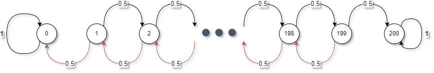

The following line sources functions from the class file `365Functions.r`. Feel free to use any of these functions throughout the semester.

```{r, message=FALSE, include=FALSE}
knitr::opts_knit$set(message=FALSE, warning=FALSE)
source("https://www.macalester.edu/~dshuman1/365/365Functions.r")
library(Matrix)
require(expm) 
require(igraph)
library(dplyr)
library(ggplot2)
library(ggrepel)
```

```{css, echo=FALSE}
.scroll {
  max-height: 250px;
  max-width: 100%;
  overflow-y: auto;
  background-color: inherit;
}
```

## Problem 1: Inverse power iteration

#### *Note: This is Part II of Activity 21*

(a) Show that if $A$ is an $n \times n$ invertible matrix and $\lambda$ is an eigenvalue of $A$ with eigenvector $v$, then $\frac{1}{\lambda}$ is an eigenvalue of $A^{-1}$ with the same eigenvector $v$.
    
    ::: answer
    $$
    \begin{align*}
    Av &= \lambda v\\
    v &= A^{-1}\lambda v\\
    \frac{1}{\lambda} v &=  A^{-1}v \qquad  ; \qquad  \lambda \neq 0 \quad \text{for invertible $A$} 
    \end{align*}
    $$
    :::

(b) What happens if you apply the power iteration to $A^{-1}$?

    ::: answer
    The eigenvectors of $A$, $v_1$, $v_2$, and $v_3$ are ordered so that their associated eigenvalues are in the order of decreasing magnitude: $|\lambda_1| > |\lambda_2| \geq |\lambda_3|$ $$\begin{align*}
    \lim_{k \to \infty}x^{(k)}&= \lim_{k \to \infty}c_k \lambda_1^k \left[a_1 v_1 + a_2 \left(\frac{\lambda_2}{\lambda_1}\right)^k v_2 + a_3 \left(\frac{\lambda_3}{\lambda_1}\right)^k v_3\right] \\
    &= c_k\lambda_i^ka_1v_1
    \end{align*}$$ which means in many iteration, the projection will converge closer to dominance eigenvector $v_1$ with the biggest $\lambda_1$ value.
    
    When we do the same iteration using $A^{-1}$ with $\frac{1}{\lambda}$, the projection will converge to the vector with the smallest $\lambda$ value since its reciprocal value will be the biggest. Thus, we will be able to find the smallest eigenvalue and the projection based on the least dominant eigenvector.
    :::

(c) Let $A$ be an $n \times n$ matrix, and let $C=A-sI$, where $I$ is the $n \times n$ identity matrix and $s$ is a scalar. Show that if $\lambda$ is an eigenvalue of $A$ with eigenvector $v$, then $\lambda-s$ is an eigenvalue of $C$ with the same eigenvector $v$. Note: $s$ is often called a **shift**.

    ::: answer
    $$
    \begin{align*}
    Av &= \lambda v \\
    Av -  sIv &= \lambda v-sIv \\
    (A - sI)v &= (\lambda-s)v \\
    \end{align*}
    $$
    
    The matrix $A-sI$ has a eigenvalue of $\lambda -s$.
    :::

(d) Let's say you had a guess $\bar{\lambda}$ for an eigenvalue of $A$ and wanted to find the associated eigenvector. Can you use the previous two results to come up with a good way to do that?

    ::: answer
    
    $$
    \begin{align*}
    Av &= \lambda v \\
    Av -  \bar\lambda Iv &= \lambda v-\bar\lambda Iv \\
    (A - \bar\lambda I)v &= (\lambda-\bar\lambda)v \\
    (A - \bar\lambda I)v + \bar \lambda v &= (\lambda-\bar\lambda)v  + \lambda v\\
    (A - \bar\lambda I)v + \bar \lambda v &= \lambda v \\
    \end{align*}
    $$
    
    :::

\

## Problem 2: A trip to Las Vegas

#### *Note: This is Exercise 2 of Activity 22*

Congratulations, you just turned 21! First step: go on kayak.com to find a cheap flight. Second step: go on hotwire.com to find a cheap hotel. Third step: Vegas, baby!

Your plan is to bring \$100 of gambling money, gamble \$1 at a time, and stop gambling when you hit \$0 (then learn how to take joy in your friends' successes) or when you hit \$200 (at which point you'll have no trouble finding different ways to spend your winnings in Vegas). Let's assume at first that the probability of winning each game is 50% (you are after all 21 and naive).

(a) Let's model your earnings with a Markov chain. What are the states? Draw a state diagram and label the edge with probabilities.

    ::: answer
    
    :::

(b) Form the transition matrix $P$. Hint: use my `TriDiag` function from `365Functions.r`. Check that $P$'s rows sum to 1 using the command `rowSums`.

    ::: answer
    ```{r,class.output="scroll"}
    
    #diagonal values
    d_value = c(1,rep(0,199), 1)
    # upper diagonal strip values
    u_value = c(0,rep(0.5,199))
    # lower diagonal strip values
    l_value =c(rep(0.5,199), 0)
    # matrix
    P = TriDiag(d_value, l_value, u_value)
    
    P
    
    rowSums(P)
    ```
    :::

(c) Numerically compute the probability that you have \$105 after placing 10 different \$1 bets.

    ::: answer
    There is 0 probability that you have \$105 after placing 10 different \$1 bets.
    
    ```{r, class.output="scroll"}
    
    #  initial condition starting with 100 dollars
    x0 = as.matrix(rep(0, 201))
    x0[101,] = 1
    
    #  after 10 time. We need to tranpose P because P was designed to have row sum to 1 not column. 
    PT = t(P)
    p2c_result = (as.matrix(PT)%^%10)%*%x0
    
    #  print transpose to avoid long scrolling
    print(p2c_result)
    ```
    :::

(d) Use `eigen` to find the eigenvalues and eigenvectors of $P^{\top}$. What do you notice? Can you explain why the eigenvectors associated with the eigenvalue 1 are steady-state distributions?

    ::: answer
    The two eigenvectors associate with the biggest eigenvalue of 1 is at steady state having 1 at the index 1 or 201 and 0 everywhere else. This is steady because when you are at these two states, you  cannot reach any other state because you either stop because you win or lose. In long run you either walkout because you win \$200 or the initial \$100. 
    
    ```{r, class.output="scroll"}
    P_eigen = eigen(PT)
    
    P_eig_value = P_eigen$values[1:2]
    P_eig_vec = P_eigen$vectors[,1:2]
    P_eig_value
    P_eig_vec
    ```
    :::

(e) This Markov chain is not irreducible! Once you reach \$0 or \$200, you cannot reach any other state. We say that those two states are ***absorbing*** states. We are interested in the absorption probabilities; i.e., what is the probability that you reach \$0 before \$200, and vice versa?
    
    To answer this, we can first reorder the state labels so that the absorption states \$0 and \$200 are the first two listed, and then everything else. That is, we can rearrange the transition matrix $P$ into the following form: $$P=\begin{bmatrix} I & 0 \\ B  & Q\end{bmatrix},$$ where
    
    -   $I$ is a 2x2 identity matrix
    
    -   $0$ is a $2 \times (N-2)$ matrix of zeros
    
    -   $B$ is a $(N-2) \times 2$ matrix giving the transition probabilities from the non-absorbing states (called the ***transient*** states) to the absorbing states, and
    
    -   $Q$ is the matrix of transition probabilities from the transient states to other transient states.
    
    Here is an example of how to rearrange a matrix in R:
    
    ```{r}
    (Z<-matrix(1:16,nrow=4,ncol=4))
    new.order<-c(1,4,2,3)
    (Z.rearranged<-Z[new.order,new.order])
    ```
    
    Once you've rearranged the transition matrix, to find the absorption probabilities, compute the ***fundamental matrix*** $S=(I-Q)^{-1}$, and the probability of absorbing into state $j$ (say \$0 in this case) starting from transient state $i$ (say \$100 in this case) is $(SB)_{ij}$. If you start with \$100, what is the probability of reaching \$200 before going broke? How does it change if you start with \$120 and only aim to make \$80 profit?
    
    Aside: we won't go in details about why $SB$ is the solution to the absorption probabilities. For that, you'll need to take some probability!

    ::: answer
    ```{r, class.output="scroll"}
    P_new_order<-c(1,201,2:200)
    (P_rearranged<-P[P_new_order,P_new_order])
    ```
    
    ```{r}
    # Check if you will go broke 
    P_rearranged.eigen = eigen(t(P_rearranged))
    P_rearranged.eigen.value = P_rearranged.eigen$values[1]
    P_rearranged.eigen.vectors = P_rearranged.eigen$vector[,1:2]
    ```
    
    ```{r}
    p2_Q = P_rearranged[3:201,3:201]
    p2_B = P_rearranged[3:201,1:2]
    p2_I = diag(1, nrow= ncol(p2_Q))
    p2_S = solve((p2_I - p2_Q))
    
    #  calculate SB
    p2_SB  = p2_S %*% p2_B
   
    
    ```
    
    If you start with \$100,the probability of reaching \$200 before going broke is 50%
    
    ```{r}
    #  start 100 and end up in the second absorbing state 200
    p2_SB[100, 2]
  
    ```
    If you start with \$120 and only aim to make $80 profit, you have 60% probability of success. 
    
    ```{r}
    p2_SB[120, 2]
    ```
    
    :::

(f) Does your probability of reaching \$200 before going broke change if you bet \$10 at a time or \$100 at a time?

    ::: answer
    
    There is no changing in probability for between placing \$10 10 times and \$100 at once. 
    ```{r}
    #  --------- Placing $10 at a time --------------
    #diagonal values for 21 states 
    d_value = c(1,rep(0,19),1)
    # upper diagonal strip values
    u_value = c(0,rep(0.5,19))
    # lower diagonal strip values
    l_value =c(rep(0.5,19), 0)
    # matrix
    P = TriDiag(d_value, l_value, u_value)
    P_new_order<-c(1,21,2:20)
    P_rearranged<-P[P_new_order,P_new_order]
    p2_Q = P_rearranged[3:21,3:21]
    p2_B = P_rearranged[3:21,1:2]
    p2_I = diag(1, nrow = nrow(p2_Q))
    p2_S = solve((p2_I - p2_Q))
    #  calculate SB
    p2_SB  = p2_S %*% p2_B
    # starting $100 -> $0
    p2_SB[10,1] 
    # starting $100 -> $200
    p2_SB[10,2]
    
    #  --------- Placing $100 at a time --------------
    #diagonal values for 3 states 
    d_value = c(1,0,1)
    # upper diagonal strip values
    u_value = c(0,0.5)
    # lower diagonal strip values
    l_value =c(0.5, 0)
    # matrix
    P = TriDiag(d_value, l_value, u_value)
    P_new_order<-c(1,3,2)
    P_rearranged<-P[P_new_order,P_new_order]
    p2_Q = P_rearranged[3,3]
    p2_B = P_rearranged[3,1:2]
    p2_I = diag(1, nrow = 1)
    p2_S = solve((p2_I - p2_Q))
    #  calculate SB
    p2_SB  = p2_S %*% p2_B
    # starting  $100 -> $0
    p2_SB[1,1] 
    # starting $100 -> $200
    p2_SB[1,2]

```
    :::

(g) The actual odds of winning a game in Vegas are not equal to 50%! Let's say you are betting on red at the roulette wheel. Assuming it is a wheel with a double zero, your chances of winning each game are $18/38 \approx 47.4$%. Now does your probability of reaching \$200 before going broke change if you bet \$10 at a time or \$100 at a time? What is the best strategy?

    Note 1 : the model in this problem does not take into account any utility you might derive from the free beverages provided by the casino for the duration of your gambling activities.
    
    Note 2: [Here](http://www.onlineroulette.ca/guides/american-vs-european-roulette.php) is some more information about single zero versus double zero roulette wheels.
    
    
    :::answer 
    
    You have a higher probability of reaching \$200 before going broke if you bet \$100 at a time than if you bet \$10 at a time. 
    ```{r}
    options(digits = 4)
    #  --------- Placing $10 at a time --------------
    #diagonal values for 21 states 
    d_value = c(1,rep(0,19),1)
    # upper diagonal strip values
    u_value = c(0,rep(0.474,19))
    # lower diagonal strip values
    l_value =c(rep(0.526,19), 0)
    # matrix
    P = TriDiag(d_value, l_value, u_value)
    P_new_order<-c(1,21,2:20)
    P_rearranged<-P[P_new_order,P_new_order]
    p2_Q = P_rearranged[3:21,3:21]
    p2_B = P_rearranged[3:21,1:2]
    p2_I = diag(1, nrow = nrow(p2_Q))
    p2_S = solve((p2_I - p2_Q))
    #  calculate SB
    p2_SB  = p2_S %*% p2_B
    # starting  10 -> $0
    p2_SB[10,1] 
    # starting 10 -> $200
    p2_SB[10,2]
    #  --------- Placing $100 at a time --------------
      #diagonal values for 21 states 
      d_value = c(1,0,1)
      # upper diagonal strip values
      u_value = c(0,0.474)
      # lower diagonal strip values
      l_value =c(0.526, 0)
      # matrix
      P = TriDiag(d_value, l_value, u_value)
      P_new_order<-c(1,3,2)
      P_rearranged<-P[P_new_order,P_new_order]
      p2_Q = P_rearranged[3,3]
      p2_B = P_rearranged[3,1:2]
      p2_I = diag(1, nrow = 1)
      p2_S = solve((p2_I - p2_Q))
      #  calculate SB
      p2_SB  = p2_S %*% p2_B
      # starting 100 -> $0
      p2_SB[1,1] 
      # starting  100 -> $200
      p2_SB[1,2]
    ```
    
    :::


## Problem 3: Medieval trade routes

#### *Note: This is Exercise 3 of Activity 22*

Russian historians often attribute the dominance and rise to power of Moscow to its strategic position on medieval trade routes (see below). Others argue that sociological and political factors aided Moscow's rise to power, and thus Moscow did not rise to power strictly because of its strategic location on the trade routes. You are to use eigenvectors to analyze this question.


Here is the list of cities and their indices in the adjacency matrix:


The following code loads the adjacency matrix into the matrix $A$ and plots the graph.

```{r, warning=FALSE, message=FALSE}
# this package is required to plot the graph
library(igraph)
```

```{r}
# This loads the adjacency matrix into A and plots it
source("https://www.macalester.edu/~dshuman1/data/365/russia.r")
```

(a) Let $B=A+I$ be the ***augmented adjacency matrix***, let $x=(1,1,\ldots,1)^{\top}$, and compute $Bx$, $B^2x$, $B^3x$. The entries are nonnegative integers, and they can be interpreted as counting something. What does the $i^{th}$ entry $(B^k x)_i$ count?

    ::: answer
    $(B^kx)_i$ is the index accessibility to other cities with $k$ number of steps from the $i^{th}$ city in the list.
    :::

(b) The sequence $Bx$, $B^2x$, $B^3x$, ... should converge to the dominant eigenvector of $B$. Explain why the dominant eigenvector of the augmented adjacency matrix is a measure of accessibility. If this is not clear, you should have a look at the article ["Linear Algebra in Geography: Eigenvectors of Networks,"](http://www.jstor.org/stable/2689388?seq=1#page_scan_tab_contents) by Philip D. Straffin, Jr. in Mathematics Magazine, November 1980.

    ::: answer
    By the definition of matrix multiplication, the $a_{ij}$ entry in $A^k$ counts the number of way of getting from vertex $i$ to vertex $j$ by paths of length $k$. Therefore, the most accessible city (vertex) should have the largest number of path to other cities (vertices). Since the sequence $Bx, B^2x, B^3x$, ... should converge to the dominant eigenvector in long run, $B^kx \approx v_1$, then this eigenvector give the Gould's index of accessibility of $B$.
    :::

(c) Is the augmented adjacency matrix $B$ primitive? How do you know?
    
    ::: answer
    $B$ is a square non-negative matrix. This matrix is **primitive** if there exists a positive integer $k$ such that all entries of $M^k$ are strictly positive. Since $B$ contains solely 1 or 0 as its entries, there exists such $k$ to make B primitive.
    :::

(d) Compute the dominant eigenvector of $B$. Do it two ways: (i) use `R`'s function `eigen`; (ii) use my power iteration function `PI`. Report the number of steps needed in power iteration so that the answer you get is correct to 2 decimal places in the infinity norm.

    ::: answer
    It takes 11 steps for power iteration to get the answer that is correct to 2 decimal places in the infinity norm. 
    ```{r}
    #  calculate B
    p3d.B = A + diag(1, nrow(A))
    #  use eigen() method
    p3d.B.eigen = eigen(p3d.B)
    p3d.B.eigenvalue = p3d.B.eigen$value[1]
    p3d.B.eigenvector = -p3d.B.eigen$vectors[,1]
    
    (p3d.B.eigenvector)
    ```
    
    ```{r}
    library(expm)
    p3d_x0 = rep(1,nrow(p3d.B))
    
    result = PI(p3d.B, p3d_x0,k=200, tol= 5e-03)
    result$steps
    
    ```
    :::

<!-- -->

e)  ***Gould's index of accessibility*** is just the dominant eigenvector of $B$, normalized so that the entries sum to 1; i.e., if $v$ is the dominant eigenvector, then Gould's index is

    <!-- -->
    
        v/sum(v)
    
    Compute Gould's index for this problem and answer the historians' question.
    
    ::: answer
    
    Moscow is in the 35th index of the matrix. Looking at the Gould's accessibility index, Moscow ranks 6 on the list.
    
    ```{r}
    
    v = p3d.B.eigenvector
    Gould_index = v/sum(v)
    
    #  index of Moscow is 35
    data.frame(Gould_index) %>% 
      mutate(index = row_number()) %>% 
      arrange(desc(Gould_index)) %>% 
      mutate(ranking = row_number())
    ```
    :::

\

## Problem 4: Dimension reduction for clustering

#### *Note: This is Exercise 3 from Activity 24*

The SVD can be used to take a two-dimensional or three-dimensional snapshot of high-dimensional data, so that dimensionally-challenged human beings can see it. In this problem you will use the top two singular values to project some data down to 2-dimensional space where you can see it.

Here is a data set on cereals:

```{r,echo=FALSE,message=FALSE}
require(foreign)
```

```{r}
cereal<-read.csv("https://www.macalester.edu/~dshuman1/data/365/cereal.csv")
A <-  as.matrix(cereal[,3:10])
print(A)
```

To perform this projection, we work with the covariance matrix $C$ of $A$. Compute this as follows:

-   For each column of $A$ subtract off the mean of that column. Then each entry is the difference from the mean of that feature

-   Now compute the matrix $C = A A^T$. This is the covariance matrix. It measures how well each of the subjects are correlated. The ij-entry is the dot product of cereal i's data with cereal j's data, so it is (roughly) the cosine of the angle between them

a)  Plot the singular values of the matrix $C$. You should see that there are 2 singular values that stand out from the rest.

    ::: answer
    
    ```{r}
    # substraction of column of C
    for(c in 1:ncol(A)){
      A[,c] = A[,c] - mean(A[,c])
    }
    # compute the matrix 
    C = A%*%t(A)
    
    #  computer SVD
    C.svd = svd(C)
    
    #  Plot
    singlular_value = data.frame(index = 1:length(C.svd$d), value = C.svd$d)
    singlular_value%>%
      ggplot() +
      geom_point(aes(x=index, y = value)) + 
      theme_classic()
    
    ```

    :::

b)  Use the vectors $x = v_1$ and $y = v_2$ from the SVD as the $x$ and $y$ coordinates of points in the plane. Plot these points. Label the $i^{th}$ point with the $i^{th}$ brand of cereal. To do this, you can use the following command after your plotting command:

    <!-- -->

        =text(x1, y1, label = cereal$brand)

    ::: answer
    
    ```{r}
    cereal_plot_data = data.frame(x = C.svd$v[,1], y = C.svd$v[,2], label = factor(cereal$brand))
    
    cereal_plot_data %>% 
      ggplot(aes(x,y, label = label, color = label)) + 
      geom_point() + 
       geom_text_repel() + 
      theme(legend.position = 'none')
    ```
    
    :::

c)  This method should group like cereals next to one another in the plane. Discuss whether you think this is happening.

    Note: You could also have used the SVD of $A^{\top}$ instead of the SVD of $C$. Why is this?

    ::: answer
    
    It is the same because the first two dominant vectors are the same.  
    ```{r}
      AT = t(A)
      AT.svd = svd(AT)
        cereal_plot_data_2 = data.frame(x = AT.svd$v[,1], y = C.svd$v[,2],    label = factor(cereal$brand))
        
      #  Plot using v[,1:2] of A^T
      cereal_plot_data %>% 
        ggplot(aes(x,y, label = label, color = label)) + 
        geom_point() + 
         geom_text_repel() + 
        theme(legend.position = 'none')
    
        
    #  The first two dominant vectors of U and A^T are similar
       C.svd$v[,1:2]
       AT.svd$v[,1:2]
    ```
    
    :::

\

## Problem 5: Least squares via the SVD

#### *Note: This is Exercise 4 from Activity 23*

Use the SVD to find a least squares solution to $Ax= b$, where $b = (15, 12, 8, 5, 7)^T$ and $A=\begin{pmatrix}1 & -1 & 2\\1 & 1& 4\\0& 0& 4\\1& 1& 2\\1& 1& 1\end{pmatrix}$.
      
(a) First do it with the reduced SVD (this is what `R` will give back if you use `svd(A)`). You should find      $x_*$, $b_*$, and the residual vector $r=b-b_*$. Compute $||r||$.
      

    :::answer
    
    $x_*$ is an approximate solution of $Ax=b$ when $b \notin Col(A)$. $b_*$ is the projection of $b$ onto $Col(A)$. 
    $$b_* = AA^+b$$. However,  $A^+ = V\Sigma^{-1}U^T$, then:
    
    $$
    \begin{align*}
    b_* &= AA^+b \\
    b_* &= U\Sigma V^T V\Sigma^{-1}U^Tb \\
    b_* &= U\Sigma\Sigma^{-1}U^Tb \\
    b_* &= UU^Tb \\
     \end{align*}
    $$
    
    ```{r}
    #  matrix A
    p5.A = matrix( c(1, -1,  2 ,1  ,1 ,4, 0,0, 4,1, 1, 2,1, 1, 1),nrow=5, ncol=3, byrow=TRUE)
    #  compute SVD
    p5.A.svd = svd(p5.A)
    #  b vector
    p5.b = c(15, 12, 8, 5, 7)
    
    #  extract left singular vectors
    p5.u = p5.A.svd$u
    #  extract right singular vectors
    p5.v = p5.A.svd$v
    #  extract vector of singular values
    p5.d =  p5.A.svd$d
    
    #  calculate b_*
    p5.bs = p5.u %*% t(p5.u)%*%p5.b
    ```
    
    $$
    \begin{align*}
    x_* &= A^+b \\
      &= V\Sigma^{-1}U^Tb \\
    \end{align*}
    $$
    
    ```{r}
    #  calculate x_* 
    p5.xs = p5.v %*% (1/p5.d * t(p5.u) %*% p5.b)
    ```
    
    ```{r}
    # calculate residual vector
    p5.rv = p5.b - p5.bs
    p5.rv
    # calculate residual
    p5.r = vnorm(p5.rv)
    p5.r
    ```
    :::

(b) Now use the full SVD to do it (you do this by telling `svd` how many vectors you want in `U` by using `nu = ???`). When you do it this way you have to be careful about dividing by zero if $A$ is not full rank, but the upside is that you can calculate $||r||$ using the vector $c=\bar{U}^T b$, without having to compute $x_*$ or $r$.

    Note: in practice, you would always compute the least squares solution with the reduced SVD, not the full one.
    
    :::answer
    For $c = \bar U^Tb$,  the least squares error (2-norm) is given by: 
    
    $$
    \sqrt{\sum_{i=r+1}^{m} c_i^2}
    $$
    Matrix $A$ has $m = 5$ and $r = 3$
    ```{r}
    # rnak of  A
    pracma::Rank(p5.A)
    
    p5b.A.svd = svd(p5.A, nu= 5)
    p5b.u = p5b.A.svd$u
    p5b.v = p5b.A.svd$v
    
    p5b.c = t(p5b.u) %*% p5.b
    p5b.r = sqrt(sum((p5b.c^2)[4:5]))
    p5b.r
    ```
    :::
